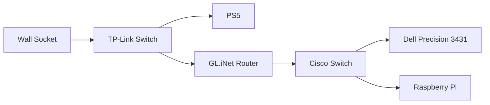

# Home Lab

A documentation of my home lab journey as a beginner in IT and networking.

## Hardware

| Device   | Model               | Purpose                      |
| -------- | ------------------- | ---------------------------- |
| Router   | GL.iNet Mango       | Network routing and firewall |
| Switch 1 | TP-Link TL-SG105S   | Main network switch          |
| Switch 2 | Cisco SG200-50P     | Home lab switch              |
| Server   | Dell Precision 3431 | Main home lab machine        |
| SBC      | Raspberry Pi 5      | Algorithmic trading bot      |

## Network Topology

## Software Stack

| Software   | Purpose        | Device              |
| ---------- | -------------- | ------------------- |
| VirtualBox | Virtualisation | Dell Precision 3431 |
| Ubuntu VM  | Linux sandbox  | Dell Precision 3431 |
| Tailscale  | Remote access  | All devices         |
| xrdp       | Remote desktop | Ubuntu VM           |
| VNC        | Remote desktop | Raspberry Pi        |

## Remote Access
All devices are accessible remotely via Tailscale:
- **Windows GUI** - Microsoft Remote Desktop
- **Ubuntu VM GUI** - Microsoft Remote Desktop via xrdp
- **Raspberry Pi GUI** - VNC Viewer
- **All devices** - SSH

## Issues and Solutions
| Issue                                                  | Solution                                                                  |
| ------------------------------------------------------ | ------------------------------------------------------------------------- |
| BIOS password on Precision 3431 (Second hand computer) | Pending - Contacting Dell Support                                         |
| Proxmox couldn't detect hard drive                     | Pending - RAID mode in BIOS - pending resolution with BIOS password reset |
| Raspberry Pi VNC black screen                          | Configured virtual display via raspi-config                               |

## Next Steps
- [ ] Resolve BIOS Password reset with Dell Support
- [ ] Migrate to Proxmox
- [ ] Set up more services on Ubuntu VM
- [ ] Expand home lab
                                                                              

## Goals
- Learn Linux and networking fundamentals
- ~Set up remote access~
- Explore virtualisation
- Document everything as I go

## Progress

### Phase 1 - Network Setup
- Set up GL.iNet Mango router in student accommodation
- Connected Cisco SG200-50P switch
- Configured DNS settings
- Established secure network behind router

### Phase 2 - Home Lab Server Setup 
- Set up Dell Precision 3431 as main home lab machine
- Installed VirtualBox and created Ubuntu VM
- Configured Ubuntu VM to start automatically on Windows boot
- Set up Windows auto login for headless operation

### Phase 3 - Remote Access 
- Installed Tailscale on all devices
- Configured SSH access to Windows, Ubuntu VM and Raspberry Pi
- Set up Remote Desktop (RDP) for Windows and Ubuntu
- Set up VNC for Raspberry Pi
- Successfully tested remote access from hotel abroad

### Phase 4 - In Progress 
- Resolving BIOS password issue with Dell support
- Planning migration to Proxmox
- Expanding home lab services
